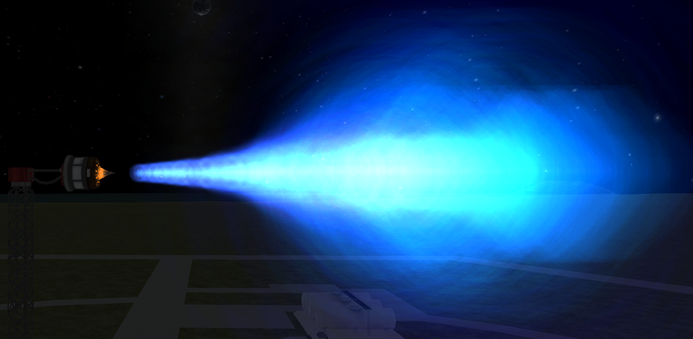
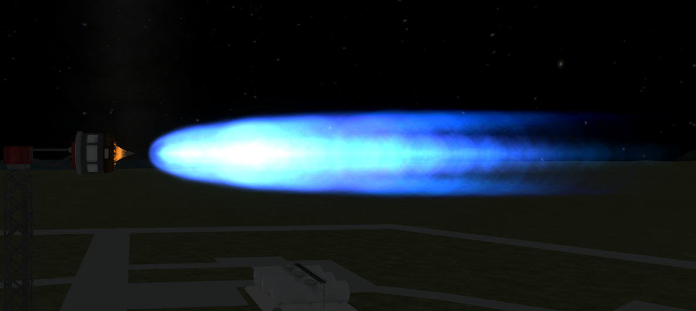
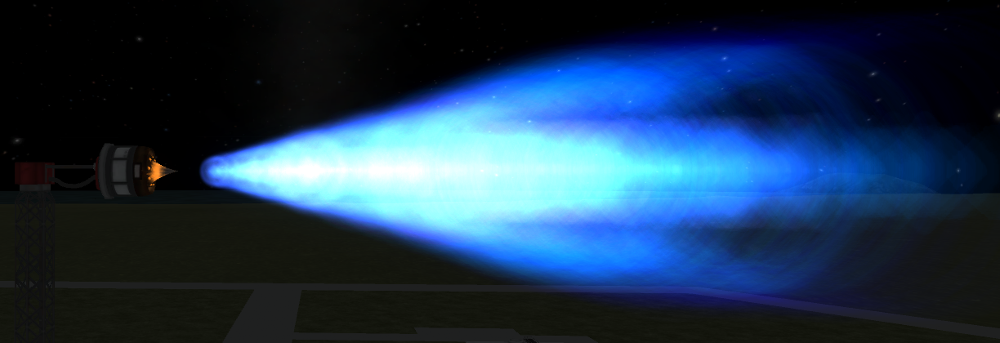

# SmokeScreen /L Unofficial

A plugin for Kerbal Space Program that adds an improved version of the MODEL_MULTI_PARTICLE effect.

Unofficial fork by Lisias.


## In a Hurry

* [Latest Release](https://github.com/net-lisias-kspu/SmokeScreen/releases)
	+ [Binaries](https://github.com/net-lisias-kspu/SmokeScreen/tree/Archive)
* [Source](https://github.com/net-lisias-kspu/SmokeScreen)
* Documentation
	+ [Project's README](https://github.com/net-lisias-kspu/SmokeScreen/blob/master/README.md)
	+ [Install Instructions](https://github.com/net-lisias-kspu/SmokeScreen/blob/master/INSTALL.md)
	+ [Change Log](./CHANGE_LOG.md)
	+ [TODO](./TODO.md) list


## Description

So how does it works ? First you need to define an effect. Look into the "HotRockets!" thread for a working example with stock KSP.

You just have to change the MODEL_MULTI_PARTICLE into a MODEL_MULTI_PARTICLE_PERSIST

Here is a minimal config with only the required info

	name = flamethrust
	modelName = MP_Nazari/FX/flamestandard
	transformName = thrustTransform

Here is the same config with all the default value shown :

```
modelName = MP_Nazari/FX/flamestandard
transformName = thrustTransform
shaderFileName =
renderMode = Billboard
collide = False
collideRatio = 0
localRotation = 0,0,0
localPosition = 0,0,0
offsetDirection = 0,0,1
fixedScale = 1
sizeClamp = 50
initialDensity = 0.6
physical = False
stickiness = 0.9
dragCoefficient = 0.1
timeModulo = 10
singleEmitTimer = 0
randomInitalVelocityOffsetMaxRadius = 0
angle = 1
distance = 1
emission
{
	power = 1
	density = 1
	mach = 1
	parttemp = 1
	externaltemp = 1
	time = 1
}
energy
{
	power = 1
	density = 1
	mach = 1
	parttemp = 1
	externaltemp = 1
	time = 1
}
speed
{
	power = 1
	density = 1
	mach = 1
	parttemp = 1
	externaltemp = 1
	time = 1
}
grow
{
	power = 0
	density = 0
	mach = 0
	parttemp = 0
	externaltemp = 0
	time = 0
}
scale
{
	power = 1
	density = 1
	mach = 1
	parttemp = 1
	externaltemp = 1
	time = 1
}
size
{
	power = 1
	density = 1
	mach = 1
	parttemp = 1
	externaltemp = 1
	time = 1
}
offset
{
	power = 0
	density = 0
	mach = 0
	parttemp = 0
	externaltemp = 0
	time = 0
}
force
{
	power = 0
	density = 0
	mach = 0
	parttemp = 0
	externaltemp = 0
	time = 0
}
logGrow
{
	power = 0
	density = 0
	mach = 0
	parttemp = 0
	externaltemp = 0
	time = 0
}
linGrow
{
	power = 0
	density = 0
	mach = 0
	parttemp = 0
	externaltemp = 0
	time = 0
}
logGrowScale
{
	power = 1
	density = 1
	mach = 1
	parttemp = 1
	externaltemp = 1
	time = 1
}
lengthScale
{
	power = 1
	density = 1
	mach = 1
	parttemp = 1
	externaltemp = 1
	time = 1
}
velocityScale
{
	power = 1
	density = 1
	mach = 1
	parttemp = 1
	externaltemp = 1
	time = 1
}
```
So now let's explain all those.

First we have 2 kind of config parameters :

- fixed parameter : all the xxx = yyy from modelName to angle
- curve : the entries with a subsection like emission or energy

### The Fixed Parameters

modelName : point to the model of your effect. it's the same as the stock FX so you'll have to find stock tutorial on how to build those in unity.

* *transformName* : part transform where your effect is attached
* *shaderFileName* : point to a compiled shader text file to replace the default shader of your model. Not testes all that much
* *renderMode* : set the particule renderMode, one of Billboard/HorizontalBillboard/SortedBillboard/Stretch/VerticalBillboard. See unity doc http://docs.unity3d.com/ScriptReference/ParticleRenderMode.html
* *localRotation* : rotation of the effect. For when you did not align correctly in unity or want to point an other way
* *localPosition* : move the effect away from the transform its attached to.
* *offsetDirection* : direction of movement when offset is used, see offset curve.
* *fixedScale* : fixed scale of the effect. For when you want to rescale to effect or the part
* *sizeClamp* : maximum size of the particle.
* *collide* : does the particle collide with stuff. False / True
* *collideRatio* : change how the particle collide. Test in game to see the effect. Set to a value between 0 and 1
* *stickiness* : how is the particle slowed on collision
* *physical* : simulate the buoyancy of the particle/gas
* *initialDensity* : density of the particle/gas at its starting size
* *dragCoefficient* : atmo drag on the particle/gas
* *timeModulo* : used with the time input (see bellow with the curve)
* *singleEmitTimer* : when different than 0 change the behaviour of single emit event ( like flameout ) and replace them with an emission of x seconds.
* *randomInitalVelocityOffsetMaxRadius* : let me copy Egg comment on the value

The initial velocity of the particles will be offset by a random amount lying in a disk perpendicular to the mean initial velocity whose radius is randomOffsetMaxRadius. This is similar to Unity's 'Random Velocity' Setting, except it will sample the offset from a (normal) disk rather than from a cube. Units (SI): m/s.

### The Simple Curves

angle and distance distance are curve with only 1 input. They are used to resize particle with the camera distance and angle with the transform. They were added for flares effects. Since they are curve you need to add the line more than once to set them up.

For exemple here is a config that show the particles if the angle of the camera with the transform is lower than 45° :

	angle = 0.0 1.0		// at 0° do not resize
	angle = 45.0 1.0		// at 45° still don't resize
	angle = 50.0 0.0		// from 45° to 50° and beyond resize to 0. (with 47.5° being half size)

### The Multiple Input Curves

Those change different parameter of the effect in relation to multiple input curve. Those inputs curves are :

* *power* : the power sent to the effect. 0 to 1. For engines it's related to the throttle (set or current, it change with the engine config)
* *density* : atmo density.
* *mach* : current speed in mach. For now mach speed is calculated for AIR.
* *parttemp* : the part temperature
* *externaltemp* : the external temperature
* *time* : time in second modulo "timeModulo". So you get a repeating sequence between 0 and timeModulo.

Curve is divided in additive and multiplicative curve. The additive add the result of the inputs and the multiplicative multiply them.

*emission* : multiplicative. Change the number of particle emitted per second

```
emission // Modulate emission from mach and density curve. You can add other section for size, energy, speed, grow, offset and scale
{
	mach = 0.0 0.0
	mach = 0.8 0.0		// don't display until mach .8
	mach = 1.0 3.0

	density = 1.0 0.0
	density = 0.4 0.0	// don't display over .4 atmo
	density = 0.3 1.0
	density = 0.002 1.0
	density = 0.001 0.0	// and stop under .001
}
```
*energy* : multiplicative. Change the energy (life in s) of each particle

*speed* : multiplicative. Change the particle speed

*grow* : additive. Change how the particle grow with time with a exponential functions. 1 is 100% per second



*scale* : multiplicative. Rescale the emitter

*size* : multiplicative. Rescale the particles

*offset* : additive. Move the emitter away from the transform in "offsetDirection"

*force* : additive. Change the power of the force applied to the particles each frame

*logGrow* : additive. Change how the particle grow with time with a logarithmic functions



*linGrow* : additive. Change how the particle grow with time linearly



*logGrowScale* : multiplicative. Change the log function base

*lengthScale* : multiplicative. How much are the particles stretched in their direction of motion.

*velocityScale* : multiplicative. How much are the particles stretched depending on "how fast they move". Use this to make particles get longer as their speed increases.

*randConeEmit*: additive default value 0 (no cone emission), similar to *randomInitalVelocityOffsetMaxRadius*, but a little less random effect appearance in-game. Forces a mirrored emission to ensure symmetric plume appearance.

*xyForce*: multiplicative default value 1, multiplicatively damps or grows horizontal (perpendicular to exhaust velocity) speed.

*zForce*: multiplicative default value 1 multiplicatively damps or grows vertical (parallel to exhaust velocity) speed.


## Installation

Detailed installation instructions are now on its own file (see the [In a Hurry](#in-a-hurry) section) and on the distribution file.

## License:

This work is licensed under the [2-Clause BSD License](https://opensource.org/licenses/BSD-2-Clause). See [here](./LICENSE).

Please note the copyrights and trademarks in [NOTICE](./NOTICE).

### Acknowledgments

Many thanks to Nothke for the ideas and test, and to Egg for his commits and helpful code review


## UPSTREAM

* [Sarbian](https://forum.kerbalspaceprogram.com/index.php?/profile/57146-sarbian/) ROOT
	+ [Forum](https://forum.kerbalspaceprogram.com/index.php?/topic/64987-*)
	+ [Github](https://github.com/sarbian/SmokeScreen/)
